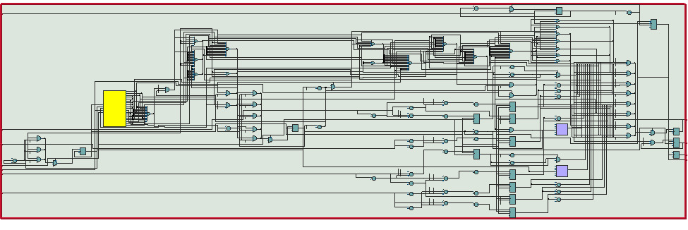

# Proyecto final - Electrónica Digital 1 - 2025-I

## 1. Integrantes

- **Juan Andrés Sierra Miranda**  
- **Nixon Sebastián Escarpeta Durán**  
- **Duván Alejandro Hernández Muñoz**  
- **Karen Alejandra Cárdenas**

## 2. Nombre del Proyecto

**ThermoGrow**: Automatización Inteligente para el Clima de Cultivos en Interiores

## 3. Documentación

ThermoGrow busca ofrecer una solución automatizada, económica y funcional para el control de temperatura en cultivos indoor. El sistema mantiene la temperatura dentro de un rango deseado mediante sensores, lógica digital implementada en FPGA y actuadores eléctricos.

Se utiliza un sensor DHT11 para medir temperatura y humedad, y un módulo de relé de 3.3 V que activa cuatro ventiladores de 12 V conectados en paralelo. La lógica de control reside en una FPGA Cyclone IV, Una pantalla LCD 16x2 informa al usuario sobre el estado del sistema en tiempo real.

El sistema se basa en máquinas de estados diseñadas en Verilog, lo cual lo hace altamente replicable y útil como herramienta educativa.

## 4. Descripción de la Arquitectura

El sistema completo incluye:

- **Sensor DHT11**: mide temperatura y humedad del ambiente.
- **FPGA Cyclone IV**: ejecuta las máquinas de estados que controlan el encendido de ventiladores y la LCD.
- **Relé 3.3 V**: recibe señal lógica y conmuta 12 V hacia los ventiladores.
- **4 Ventiladores 12 V**: se activan simultáneamente cuando la temperatura es alta.
- **Pantalla LCD 16x2**: muestra temperatura y humedad.
- **Fuente de 12 V**: alimenta los ventiladores.

### Lógica de control:

- Si la temperatura > 20 °C → se activa el relé → se encienden los ventiladores.  
- Si la temperatura < 15 °C → se desactiva el relé → se apagan los ventiladores.

## 5. Diagramas de la Arquitectura

###  Diagrama de conexión del sistema

###  Máquina de estados para el ventilador

###  Máquina de estados para la LCD

###  Bloque de sensor de temperatura

### RTL de la LCD

## 6. Simulaciones

Se diseñaron y simularon las máquinas de estados en Verilog. Las pruebas lógicas confirmaron:

- Activación de `fan_enable` cuando `temp > 20`
- Desactivación de `fan_enable` cuando `temp < 15`
- Secuencia correcta de instrucciones a la LCD en respuesta al sensor

## 7. Implementación

El sistema se montó en una caja de cartón reforzada con palos de balso. Los cuatro ventiladores se conectaron en paralelo y controlados por un único relé. La alimentación se realizó con una fuente de 12 V DC, y se integraron todos los módulos en protoboard.

### Pruebas realizadas:

1. Se verificaron conexiones y alimentación.
2. Se simuló una subida de temperatura → los ventiladores se encendieron automáticamente.
3. Se retiró la fuente de calor → los ventiladores se apagaron al bajar la temperatura.

Estas pruebas confirmaron el correcto funcionamiento del sistema de control.
### video de la implementacion
[circuito implementado](imp.MP4)

## 8. Resumen

Tras la compilación del diseño `thermogrow_top` en la FPGA **Cyclone IV EP4CE10E22C8**, se obtuvo el siguiente resumen de uso de recursos:

| Recurso                                 | Valor utilizado         | Capacidad total       | Porcentaje usado |
|----------------------------------------|--------------------------|------------------------|------------------|
| **Elementos lógicos (LEs)**            | 1,347                    | 10,320                 | 13 %             |
| **Registros (flip-flops)**             | 225                      | —                      | —                |
| **Pines utilizados**                   | 19                       | 92                     | 21 %             |
| **Memoria embebida**                   | 0 bits                   | 423,936 bits           | 0 %              |
| **Multiplicadores de 9 bits**          | 0                        | 46                     | 0 %              |
| **PLLs (Phase-Locked Loops)**          | 0                        | 2                      | 0 %              |

El proyecto hace uso de solo el **13 % de los elementos lógicos** disponibles, lo cual demuestra que ThermoGrow es un diseño compacto y eficiente. No utiliza bloques de memoria embebida, multiplicadores ni PLLs, lo cual simplifica su implementación y reduce el consumo de recursos. Esta eficiencia deja un margen amplio para futuras mejoras como la incorporación de nuevos sensores, interfaz de red, control de riego, o procesamiento adicional.

## 9. Referencias

1. Documento interno. Avance Proyecto Final: *ThermoGrow*. 2025.  
2. Donta, P. K., et al. (2021). *Design of an FPGA-based embedded system for greenhouse monitoring and control*.  
3. Kozai, T., Niu, G., & Takagaki, M. (2019). *Plant Factory: An Indoor Vertical Farming System*. Academic Press.  
4. Vahid, F. (2010). *Verilog for Digital Design*. John Wiley & Sons.  

