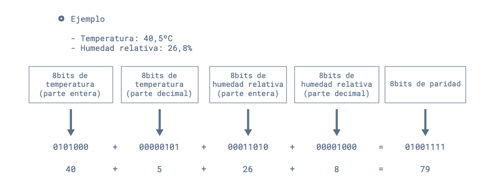

# Proyecto final - Electrónica Digital 1 - 2025-I

## 1. Integrantes

- **Juan Andrés Sierra Miranda**  
- **Nixon Sebastián Escarpeta Durán**  
- **Duván Alejandro Hernández Muñoz**  
- **Karen Alejandra Cárdenas**

## 2. Nombre del Proyecto

**ThermoGrow**: Automatización Inteligente para el Clima de Cultivos en Interiores

## 3. Documentación

ThermoGrow busca ofrecer una solución automatizada, económica y funcional para el control de temperatura en cultivos indoor. El sistema mantiene la temperatura dentro de un rango deseado mediante sensores, lógica digital implementada en FPGA y actuadores eléctricos.

Se utiliza un sensor DHT11 para medir temperatura y humedad, y un módulo de relé de 3.3 V que activa cuatro ventiladores de 12 V conectados en paralelo. La lógica de control reside en una FPGA Cyclone IV, Una pantalla LCD 16x2 informa al usuario sobre el estado del sistema en tiempo real.

El sistema se basa en máquinas de estados diseñadas en Verilog, lo cual lo hace altamente replicable y útil como herramienta educativa.

## 4. Descripción de la Arquitectura

El sistema completo incluye:

- **Sensor DHT11**: mide temperatura y humedad del ambiente.
- **FPGA Cyclone IV**: ejecuta las máquinas de estados que controlan el encendido de ventiladores y la LCD.
- **Relé 3.3 V**: recibe señal lógica y conmuta 12 V hacia los ventiladores.
- **4 Ventiladores 12 V**: se activan simultáneamente cuando la temperatura es alta.
- **Pantalla LCD 16x2**: muestra temperatura y humedad.
- **Fuente de 12 V**: alimenta los ventiladores.

### Lógica de control:

- Si la temperatura > 20 °C → se activa el relé → se encienden los ventiladores.  
- Si la temperatura < 15 °C → se desactiva el relé → se apagan los ventiladores.

## 5. Diagramas de la Arquitectura

###  Diagrama de conexión del sistema

###  Máquina de estados para el ventilador

###  Máquina de estados para la LCD

###  Bloque de sensor de temperatura

### RTL de la LCD

## 6. Simulaciones

Se diseñaron y simularon las máquinas de estados en Verilog. Las pruebas lógicas confirmaron:

- Activación de `fan_enable` cuando `temp > 20`
- Desactivación de `fan_enable` cuando `temp < 15`
- Secuencia correcta de instrucciones a la LCD en respuesta al sensor

Se adjunta una imagen de la simulación que también se puede ejecutar en el archivo del repositorio nombrado testbench_thermogrow.v

Aquí se muestra el cambio entre estados ON y OFF para los ventiladores según se alcanza el umbral determinado. Como objetivo presentado durante la documentación del proyecto, establecimos que ese umbral debía ser entre 15°C a 20°C. Una vez logramos este comportamiento en simulación, se hizo necesario durante la implementación, añadir un estado intermedio llamado WAIT donde los ventiladores permanecen apagados mientras se encuentran en el umbral, decidimos esto para evitar errores en los valores límite del umbral y que no se indeterminara el comportamiento que debía tener. 

La simulación del testbench que se encuentra en el archivo dht11_tb.v, arrojó los siguientes resultados:

Esta simulación muestra la transición entre estados IDLE y READ_BIT en la lectura de datos del sensor. Aquí se detectan flancos de bajada en la línea de datos y se almacenan los 40 bits que nos sirven para la interpretación de los datos en la pantalla LCD. 

Es necesario recordar esta distribución: 

Donde se divide claramente en 5 bytes que cada uno representa un dato de temperatura y humedad respectivamente. 

El comportamiento se podría resumir en el siguiente diagrama: 

Con esta simulación pudimos pasar con éxito a la implementación en FPGA, dado que logramos ver una consistencia en el modo de recepción de datos cuando el sensor responde. 
Vimos como se capturaban los 40 bits en cada lectura. También se puede ver cómo checksum ayuda a validar los datos, sin embargo, en la implementación no encontramos con un problema que nos evitó el correcto manejo del checksum.

## 7. Implementación
El gran desafío del proyecto fue hacer funcionar el sensor de temperatura DHT11. La implementación del protocolo one-wire constituyó el núcleo fundamental de este proyecto. Este protocolo presenta desafíos únicos por su naturaleza bidireccional en un solo cable, donde la sincronización temporal es crítica para la comunicación exitosa con el sensor DHT11. Al hacer la comunicación en un único pin definido como in-out se hace necesario tener una temporización precisa para capturar los 40 bits de lectura correctamente. 
El siguiente diagrama representa la lógica de transición de estados del sensor:

El descubrimiento de cómo el lector recibía 41 bits en vez de 40 como se esperaba nos llevó a hacer un experimento con el analizador de pulsos. Estos fueron los datos extraídos con ayuda de un Arduino ONE.
### Pulseview Arduino:

### Pulseview FPGA:

Este fue el gran punto de quiebre del proyecto que nos permitió escoger el correcto orden de bits que proporcionaba la lectura del sensor. Teoŕicamente, esperabamos unos registros de la forma cómo se mostró en el gráfico. Sin embargo, se hizo necesario un desplazamiento de bits de la siguiente manera: hum1 <= shift_reg[38:31];
                    hum2 <= shift_reg[30:23];
                    temp1 <= shift_reg[22:15];
                    temp2 <= shift_reg[14:7];
                    checksum <= shift_reg[6:0]

Así conseguimos una lectura fiable, con el costo de perder un bit para el checksum, lo cual podría llevar a mostrar lecturas erróneas y reconocemos que es un aspecto a mejorar en cuanto al código del proyecto. Una posibilidad sería la supresión de ese bit extra que nos generaba confusión, con una manera de aislarlo se podría generar un estado de arranque que ignore ese primer bit y no se tenga que desplazar a costa de perder información de los bits de checksum.
Una vez esto se pudo lograr, el módulo de la pantalla LCD, tomó más líneas de código y más estados porque también se logró tener la lectura de humedad, lo cual es un añadido importante que no habíamos contemplado al inicio del proyecto. En resumen, aquí fue donde más conceptos de las prácticas de laboratorio pudimos aplicar como la división de cifras por centenas, decenas, unidades, el funcionamiento de la pantalla LCD, el divisor de frecuencia para una visualización confiable de los datos, entre otros.
Para mayor robustez y lograr el objetivo del proyecto se implementó una máquina de estados para el control del ventilador que se encuentra en 'fsm_fan_control.v', que pasa entre los estados ON, WAIT y OFF, como se explicó anteriormente. Los rangos fueron modificados para acelerar la sustentación del proyecto de 23°C a 25°C. Esto se puede cambiar fácilmente en módulo de fsm_fan_control.v.    
El sistema se montó en una caja de cartón reforzada con palos de balso. Los cuatro ventiladores se conectaron en paralelo y controlados por un único relé. La alimentación se realizó con una fuente de 12 V DC, y se integraron todos los módulos en la FPGA por medio de un módulo top para un mayor orden. Con ayuda de la protoboard se realizó la conexión del sensor con la FPGA y también con el relé para seguridad de la FPGA y de todos los componentes.

### Pruebas realizadas:

1. Se verificaron conexiones y alimentación.
2. Se simuló una subida de temperatura → los ventiladores se encendieron automáticamente.
3. Se retiró la fuente de calor → los ventiladores se apagaron al bajar la temperatura.

Estas pruebas confirmaron el correcto funcionamiento del sistema de control.
### Video de la implementacion
[circuito implementado](imp.MP4)

## 8. Resumen

Tras la compilación del diseño `thermogrow_top` en la FPGA **Cyclone IV EP4CE10E22C8**, se obtuvo el siguiente resumen de uso de recursos:

| Recurso                                 | Valor utilizado         | Capacidad total       | Porcentaje usado |
|----------------------------------------|--------------------------|------------------------|------------------|
| **Elementos lógicos (LEs)**            | 1,347                    | 10,320                 | 13 %             |
| **Registros (flip-flops)**             | 225                      | —                      | —                |
| **Pines utilizados**                   | 19                       | 92                     | 21 %             |
| **Memoria embebida**                   | 0 bits                   | 423,936 bits           | 0 %              |
| **Multiplicadores de 9 bits**          | 0                        | 46                     | 0 %              |
| **PLLs (Phase-Locked Loops)**          | 0                        | 2                      | 0 %              |

El proyecto hace uso de solo el **13 % de los elementos lógicos** disponibles, lo cual demuestra que ThermoGrow es un diseño compacto y eficiente. No utiliza bloques de memoria embebida, multiplicadores ni PLLs, lo cual simplifica su implementación y reduce el consumo de recursos. Esta eficiencia deja un margen amplio para futuras mejoras como la incorporación de nuevos sensores, interfaz de red, control de riego, o procesamiento adicional.

## 9. Referencias

1. Documento interno. Avance Proyecto Final: *ThermoGrow*. 2025.  
2. Donta, P. K., et al. (2021). *Design of an FPGA-based embedded system for greenhouse monitoring and control*.  
3. Kozai, T., Niu, G., & Takagaki, M. (2019). *Plant Factory: An Indoor Vertical Farming System*. Academic Press.  
4. Vahid, F. (2010). *Verilog for Digital Design*. John Wiley & Sons.  

